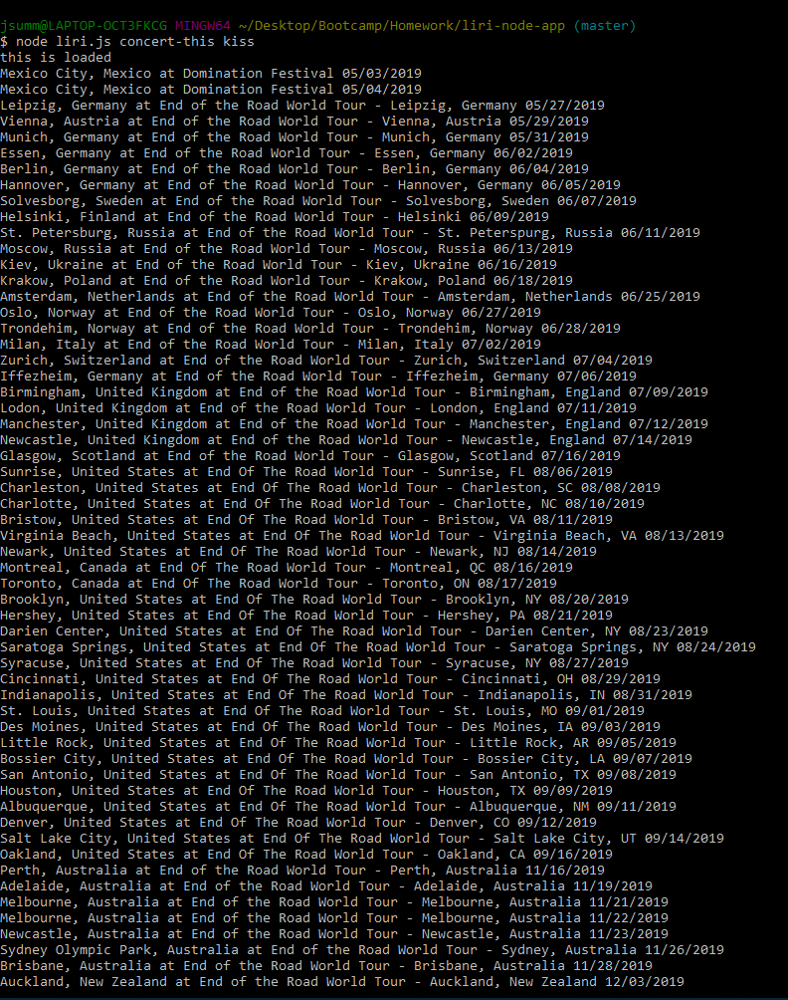
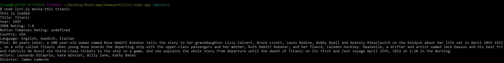
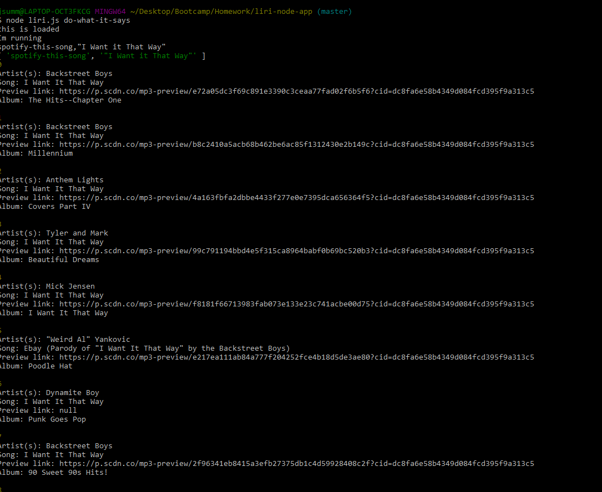

# liri-node-app

Liri is a command-line node application. 
Liri is like iPhone's SIRI. However, while SIRI is a Speech Interpretation and Recognition Interface, LIRI is a Language Interpretation and Recognition Interface. LIRI will be a command line node app that takes in parameters and gives you back data.

This application provides 4 commands that will excecute api calls and output data. 

Concert-this takes a band as an argument and returns any upcoming concerts from the BandsinTown api.

Format: $ node liri.js concert-this beyonce

Spotify-this-song takes a song as an argument and returns a list of artists from the Spotify api.

Format: $ node liri.js spotify-this-song mac-the-knife

Movie-this takes a movie title as an argument and returns movie data from the OMDB api.

Format: $ node liri.js movie-this titanic

Do-what-it-says reads the contents of the random.txt file and runs that commands.

Format: $ node liri.js do-what-it-says

